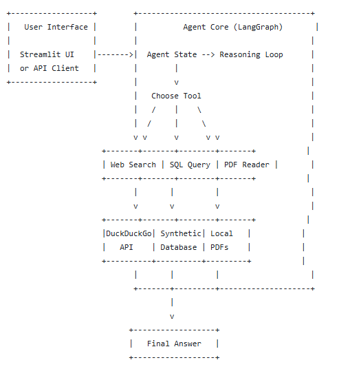

# Agentic Research Assistant

A multi‑tool AI agent that answers questions by combining web search, SQL queries, and PDF reading. Built with LangGraph and Ollama.

## Architecture

 

+------------------+        +--------------------------------------+
|   User Interface |        |          Agent Core (LangGraph)       |
|                  |        |                                      |
|  Streamlit UI    |------->|  Agent State --> Reasoning Loop      |
|  or API Client   |        |        |                             |
+------------------+        |        v                             |
                            |   Choose Tool                        |
                            |   /    |    \                        |
                            |  /     |     \                       |
                            v v      v      v v                    |
                     +-------+-------+--------+-------+           |
                     | Web Search | SQL Query | PDF Reader |       |
                     +-------+-------+--------+-------+           |
                            |       |         |                    |
                            v       v         v                    |
                     +-------+-------+--------+-------+           |
                     |DuckDuckGo| Synthetic| Local   |           |
                     |   API    | Database | PDFs    |           |
                     +----------+----------+---------+           |
                            |       |         |                    |
                            +-------+---------+--------------------+
                                    |
                                    v
                           +------------------+
                           |   Final Answer   |
                           +------------------+

## Tech Stack
- LangGraph – agent orchestration
- FastAPI – API
- Streamlit – UI
- Ollama – LLM (llama3.2 / mistral)
- DuckDuckGo Search – free web search
- PyPDF – PDF extraction
- SQLite / PostgreSQL – synthetic database

## Setup

1. **Clone** the repository.
2. **Create virtual environment** and install dependencies:
   ```bash
   pip install -r requirements.txt
   ```
3. **Install Ollama** and pull a model:
   ```bash
   ollama pull llama3.2
   ```
4. **Set up the synthetic database**:
   ```bash
   python scripts/init_db.py
   ```
5. **Add PDFs** to the `data/` folder (optional).
6. **Run the agent API**:
   ```bash
   uvicorn src.agent:app --reload
   ```
7. **Run the UI** (optional):
   ```bash
   streamlit run app.py
   ```

## Usage

- **API**: `POST /query` with `{"question": "..."}` returns answer and tool traces.
- **UI**: Type a question; the agent will decide which tools to use and show reasoning steps.

## Example Questions
- "What is the capital of France?" (triggers web search)
- "Show me the top 5 customers by spending" (triggers SQL)
- "Summarize the PDF about AI" (triggers PDF reader)

## License
MIT